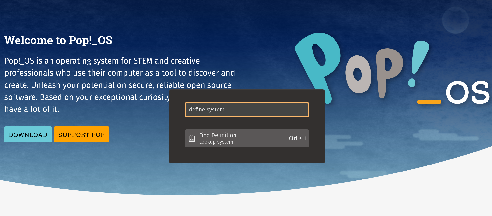
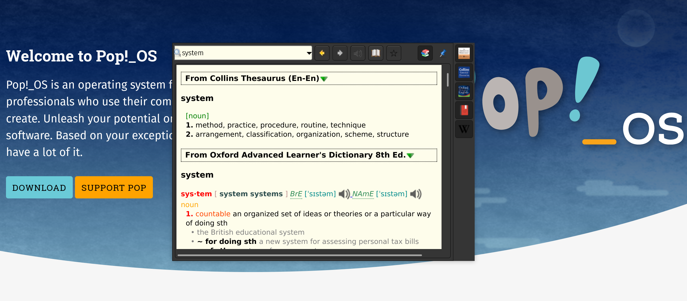

# A Dictionary Configuration for Pop!_OS

This brings together several resources that create an easy-to-use dictionary experience similar to Mac OS X. You can open the Pop Launcher and type "define XYZ" to show the definition of XYZ in multiple dictionaries.

## Setup

#### Automated

`/bin/bash -c "$(curl -fsSL https://raw.githubusercontent.com/canadaduane/pop-dictionary/main/install.sh)"`

#### Manual

1. Install GoldenDict (e.g. via flatpak)
2. Install Dictionaries
3. Install Pop Launcher "define" plugin
4. Open  your GoldenDict settings and tell it where your shiny new dictionaries are located (`~/dictionaries`)

See the `install.sh` script which automates steps 2 & 3.

## English Dictionaries

See `dictionaries.md` for a list of sources of English language dictionaries, freely available. Then you can download that dictionary to `~/.pop-dictionary/dictionaries` and extract.